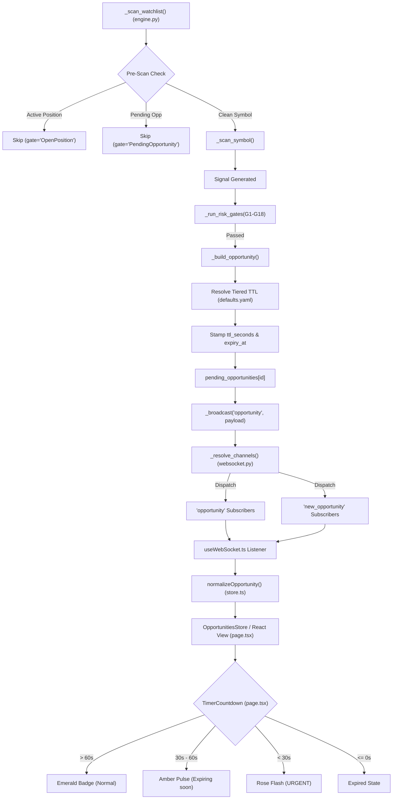

# UltraBot Architecture Reference

Single-source technical reference for UltraBot generated directly from verified source files.

---

## 1. Risk Gates (G1 – G18)

The 18 risk gates are evaluated sequentially by `RiskEngine.validate()` (`ultrabot-web/backend/risk/risk_engine.py:90-100`). Each gate receives the risk config dictionary and extracts its parameters on construction.

| Gate | Class Name | Source File | Config Key(s) & Lookup | Literal Default | Logic & Checks |
|---|---|---|---|---|---|
| **G1** | `G1MaxPositions` | `ultrabot-web/backend/risk/gates/g1_max_positions.py:10-51` | `config.get("max_open_positions", 3)` | `3` | Fails if `open_count >= max_open_positions` (`:29`). |
| **G2** | `G2SectorConcentration` | `ultrabot-web/backend/risk/gates/g2_sector_concentration.py:12-57` | `config.get("max_per_sector", 2)`, `config.get("max_sector_concentration_pct", 40.0)` | `2`, `40.0%` | Calculates `effective_max = min(max_per_sector, max_positions * max_sector_pct / 100)`; fails if `current_count >= effective_max` (`:31-33`). |
| **G3** | `G3MaxPositionSize` | `ultrabot-web/backend/risk/gates/g3_max_position_size.py:11-93` | `config.get("max_per_position_pct")` or `config.get("max_position_size_pct")` or `config.get("max_capital_per_trade_pct")` or `25` | `25%` | Uses `resolve_total_capital(context=context)` (`:27`); fails if `position_value > total_capital * (max_position_pct / 100.0)` (`:66-69`). |
| **G4** | `G4MaxDailyTrades` | `ultrabot-web/backend/risk/gates/g4_max_daily_trades.py:10-41` | `config.get("max_daily_trades", 10)` | `10` | Fails if `daily_trades >= max_daily_trades` (`:19`). |
| **G5** | `G5MaxDailyLoss` | `ultrabot-web/backend/risk/gates/g5_max_daily_loss.py:11-64` | `config.get("max_daily_loss_pct", 3)` | `3%` | Uses `resolve_total_capital(context=context)` (`:26`); fails closed with critical if `total_capital <= 0` (`:30`); fails if cumulative `daily_pnl <= -(total_capital * max_daily_loss_pct / 100.0)` (`:44-46`). |
| **G6** | `G6CorrelationCheck` | `ultrabot-web/backend/risk/gates/g6_correlation_check.py:54-112` | `config.get("max_pairwise_correlation", config.get("max_correlation", 0.85))` | `0.85` | Checks pairwise empirical correlation against open positions; fails if `corr >= max_correlation` (`:90-92`). |
| **G7** | `G7VIXFilter` | `ultrabot-web/backend/risk/gates/g7_vix_filter.py:11-64` | `config.get("vix_threshold")` or `config.get("vix_high_threshold")` or `22.0`; `config.get("vix_extreme_threshold", 35.0)` | `22.0`, `35.0` | Fails with critical if `vix >= 35.0` (`:36`), warning if `vix > 22.0` (`:46`); passes if VIX is unavailable (`:24-32`). |
| **G8** | `G8TimeOfDay` | `ultrabot-web/backend/risk/gates/g8_time_of_day.py:15-75` | `config.get("new_trade_window_start", "09:30")`, `config.get("new_trade_window_end", "14:30")` | `"09:30"`, `"14:30"` IST | Fails if current IST time is not within `[09:30, 14:30]` (`:53-67`). |
| **G9** | `G9PriceMismatch` | `ultrabot-web/backend/risk/gates/g9_price_mismatch.py:11-71` | `config.get("price_mismatch_threshold_pct", 0.5)` | `0.5%` | Fails if `abs(entry_price - broker_ltp) / broker_ltp * 100.0 > 0.5` (`:43-45`). |
| **G10** | `G10MinConfidence` | `ultrabot-web/backend/risk/gates/g10_min_confidence.py:11-44` | `config.get("min_signal_confidence", 0.6)` | `0.6` | Fails if signal `confidence < min_confidence` (`:20`). |
| **G11** | `G11MaxDrawdown` | `ultrabot-web/backend/risk/gates/g11_max_drawdown.py:11-44` | `config.get("max_drawdown_pct", 5)` | `5%` | Fails if `current_drawdown_pct > max_drawdown_pct` (`:20`). |
| **G12** | `G12MarginCheck` | `ultrabot-web/backend/risk/gates/g12_margin_check.py:13-123` | `config.get("max_capital_usage_pct", 90)` | `90%` | Uses `resolve_total_capital(context=context)` (`:29`); calculates required margin by segment (Options: 100%, Futures/Intraday: 20-25%); fails if `required_margin > available_margin` (`:84`) or `projected_capital_in_use > total_capital * 0.90` (`:99`). |
| **G13** | `G13DuplicateSignal` | `ultrabot-web/backend/risk/gates/g13_duplicate_signal.py:14-100` | `config.get("duplicate_signal_lookback_minutes", 15)` | `15 min` | Queries DB for signals on same symbol + direction within lookback cutoff; fails if duplicate found (`:51-66`). |
| **G14** | `G14StrategyBacktest` | `ultrabot-web/backend/risk/gates/g14_strategy_backtest.py:33-111` | `config.get("min_backtest_win_rate", 0.55)`, `config.get("min_backtest_profit_factor", 1.25)` | `0.55 (55%)`, `1.25` | Validates strategy backtest profile; fails if `win_rate < 0.55` (`:74`) or `profit_factor < 1.25` (`:87`). |
| **G15** | `G15VolumeLiquidity` | `ultrabot-web/backend/risk/gates/g15_volume_liquidity.py:12-56` | `config.get("min_volume_ratio", 1.0)` | `1.0x` | Fails if `volume_ratio < 1.0` (relative to 20-period average volume) (`:33`). |
| **G16** | `G16MultiTimeframe` | `ultrabot-web/backend/risk/gates/g16_multi_timeframe.py:11-76` | `config.get("require_trend_alignment", True)` | `True` | Fails if BUY/LONG and higher TF trend is Bearish (`:38`), or SELL/SHORT and higher TF trend is Bullish (`:47`), or neutral trend with breakout strategy and `confidence < 0.60` (`:58`). |
| **G17** | `G17CostPreCheck` | `ultrabot-web/backend/risk/gates/g17_cost_precheck.py:27-126` | `risk_cfg.get("max_fee_pct_of_risk", 30.0)`, `hard_risk_pct` (1.0), `brokerage_per_order` (20.0) | `30.0%` | Estimates quantity from the hard-risk budget, computes real round-trip NSE fees (both legs) via `NSEFeeCalculator`, fails if fees exceed `max_fee_pct_of_risk`% of estimated gross monetary risk. Passes (info) when signal geometry is incomplete. |
| **G18** | `G18StrategyGuard` | `ultrabot-web/backend/risk/gates/g18_strategy_guard.py:27-139` | `per_strategy_daily_loss_pct` (1.0) + `per_strategy_daily_loss_overrides`, `per_strategy_consec_loss_limit` (2), `per_strategy_consec_loss_cooldown_minutes` (240) | `1.0%`, `2`, `240 min` | Blocks NEW entries of a strategy when its realized net P&L today ≤ −(cap% of total capital), or during the cooldown window after N consecutive losing closes. All inputs come from the trades ledger (real executions only). |

> **Note on telemetry namespaces**: the Phase-5 data-freshness skip in `core/engine.py` emits a `DATA_STALE_CANDLES` telemetry event (status `SKIPPED`). It is deliberately **not** a `G<number>` id — the G16 namespace belongs exclusively to `G16MultiTimeframe`.

### 1.1 Canonical Capital Resolution (`core/capital_resolver.py`)

Total capital resolution is unified across all gates, position sizers, and engine evaluation paths via `resolve_total_capital(context, engine, config)` (`ultrabot-web/backend/core/capital_resolver.py:15-70`):

1. **Context Evaluation**: Evaluates `context["total_capital"]` or `context["capital"]` using explicit `is not None` checks. Legitimate values (including `0.0` or negative capital) are preserved and returned directly.
2. **Engine Evaluation**: Evaluates `engine.initial_capital` if an `UltraBotEngine` instance is passed with `is not None`.
3. **Configuration / Settings Fallback**: Checks passed `config` (dict or settings object) or global `config.settings.settings`, reading `virtual_capital` (default `500000.0`).
4. **Hard Fallback**: Returns the canonical `default_fallback` (`500000.0`, matching `defaults.yaml` `capital.virtual_capital`) if all prior sources are completely absent.

**Call Sites Migrated**:
- `G3MaxPositionSize` (`risk/gates/g3_max_position_size.py:27`)
- `G5MaxDailyLoss` (`risk/gates/g5_max_daily_loss.py:26`)
- `G12MarginCheck` (`risk/gates/g12_margin_check.py:29`)
- `PositionSizer` (`risk/position_sizer.py:38`)
- `RiskEngine.evaluate` context fallback (`risk/risk_engine.py:154-166`)
- `UltraBotEngine` (`core/engine.py:1033, 1041, 1112, 1640, 2626`)

---

## 2. Database Schema (SQLAlchemy 2.0 ORM Models)

All models defined in `ultrabot-web/backend/db/migrations.py:18-335`. Primary keys use `Text` with UUID4 defaults (`_generate_uuid`). SQLite database located at `ultrabot-web/backend/data/ultrabot.db` (`ultrabot-web/backend/db/database.py:19`).

1. **`sessions`** (`ultrabot-web/backend/db/migrations.py:33-44`):
   `id` (Text, PK), `date` (Text), `start_time` (Text), `end_time` (Text, nullable), `status` (Text, default "running"), `engine_state` (Text, default "{}"), `metadata_json` (Text, default "{}"), `created_at` (Text), `updated_at` (Text).
2. **`trades`** (`ultrabot-web/backend/db/migrations.py:50-81`):
   `id` (Text, PK), `session_id` (Text, nullable), `signal_id` (Text, nullable), `position_id` (Text, nullable), `symbol` (Text), `direction` (Text), `strategy` (Text), `entry_price` (Float), `exit_price` (Float, nullable), `quantity` (Integer), `stop_loss` (Float, nullable), `target` (Float, nullable), `actual_sl` (Float, nullable), `actual_target` (Float, nullable), `status` (Text, default "OPEN"), `exit_reason` (Text, nullable), `entry_time` (Text), `exit_time` (Text, nullable), `pnl` (Float, default 0.0), `pnl_pct` (Float, default 0.0), `brokerage` (Float, default 0.0), `fees` (Float, default 0.0), `net_pnl` (Float, default 0.0), `holding_duration_seconds` (Integer, nullable), `notes` (Text, nullable), `tags` (Text, default "[]"), `extra` (Text, default "{}"), `created_at` (Text), `updated_at` (Text).
3. **`signals`** (`ultrabot-web/backend/db/migrations.py:87-110`):
   `id` (Text, PK), `session_id` (Text, nullable), `symbol` (Text), `direction` (Text), `strategy` (Text), `confidence` (Float, default 0.0), `entry_price` (Float, nullable), `stop_loss` (Float, nullable), `target` (Float, nullable), `risk_reward` (Float, nullable), `status` (Text, default "PENDING"), `rejection_reason` (Text, nullable), `kronos_score` (Float, nullable), `vix_at_signal` (Float, nullable), `regime_at_signal` (Text, nullable), `sector` (Text, nullable), `lot_size` (Integer, nullable), `signal_data` (Text, default "{}"), `risk_gate_results` (Text, default "{}"), `created_at` (Text), `updated_at` (Text).
4. **`positions`** (`ultrabot-web/backend/db/migrations.py:116-149`):
   `id` (Text, PK), `session_id` (Text, nullable), `trade_id` (Text, nullable), `signal_id` (Text, nullable), `symbol` (Text), `direction` (Text), `strategy` (Text), `entry_price` (Float), `current_price` (Float, nullable), `quantity` (Integer), `invested_amount` (Float, default 0.0), `stop_loss` (Float, nullable), `target` (Float, nullable), `initial_sl` (Float, nullable), `initial_target` (Float, nullable), `booked_qty` (Integer, default 0), `booked_pnl` (Float, default 0.0), `remaining_qty` (Integer, default 0), `status` (Text, default "OPEN"), `entry_time` (Text), `exit_time` (Text, nullable), `unrealized_pnl` (Float, default 0.0), `realized_pnl` (Float, default 0.0), `max_favorable_excursion` (Float, default 0.0), `max_adverse_excursion` (Float, default 0.0), `trailing_sl_active` (Boolean, default False), `current_trailing_sl` (Float, nullable), `partial_book_level` (Integer, default 0), `extra` (Text, default "{}"), `created_at` (Text), `updated_at` (Text).
5. **`watchlist`** (`ultrabot-web/backend/db/migrations.py:155-170`):
   `id` (Text, PK), `symbol` (Text, unique), `name` (Text), `sector` (Text, nullable), `lot_size` (Integer, nullable), `is_fno` (Boolean, default True), `is_active` (Boolean, default True), `added_at` (Text), `last_scanned_at` (Text, nullable), `last_signal_at` (Text, nullable), `extra` (Text, default "{}"), `created_at` (Text), `updated_at` (Text).
6. **`strategy_performance`** (`ultrabot-web/backend/db/migrations.py:176-200`):
   `id` (Text, PK), `strategy` (Text, unique), `total_trades` (Integer, default 0), `wins` (Integer, default 0), `losses` (Integer, default 0), `breakeven` (Integer, default 0), `win_rate` (Float, default 0.0), `avg_win` (Float, default 0.0), `avg_loss` (Float, default 0.0), `total_pnl` (Float, default 0.0), `max_win` (Float, default 0.0), `max_loss` (Float, default 0.0), `profit_factor` (Float, default 0.0), `avg_holding_seconds` (Float, default 0.0), `sharpe_ratio` (Float, default 0.0), `max_consecutive_wins` (Integer, default 0), `max_consecutive_losses` (Integer, default 0), `is_enabled` (Boolean, default True), `daily_stats` (Text, default "{}"), `extra` (Text, default "{}"), `created_at` (Text), `updated_at` (Text).
7. **`risk_events`** (`ultrabot-web/backend/db/migrations.py:206-220`):
   `id` (Text, PK), `session_id` (Text, nullable), `event_type` (Text), `severity` (Text, default "info"), `symbol` (Text, nullable), `strategy` (Text, nullable), `message` (Text), `value` (Float, nullable), `threshold` (Float, nullable), `action_taken` (Text, nullable), `extra` (Text, default "{}"), `created_at` (Text).
8. **`broker_credentials`** (`ultrabot-web/backend/db/migrations.py:226-237`):
   `id` (Text, PK), `broker_name` (Text, unique), `is_enabled` (Boolean, default False), `encrypted_credentials` (Text, default ""), `last_connected_at` (Text, nullable), `last_error` (Text, nullable), `extra` (Text, default "{}"), `created_at` (Text), `updated_at` (Text).
9. **`error_logs`** (`ultrabot-web/backend/db/migrations.py:243-263`):
   `id` (Text, PK), `error_code` (Text), `error_type` (Text), `severity` (Text, default "error"), `what_happened` (Text), `why_happened` (Text, nullable), `how_to_fix` (Text, nullable), `context` (Text, default "{}"), `stack_trace` (Text, nullable), `is_resolved` (Boolean, default False), `resolved_at` (Text, nullable), `resolution_note` (Text, nullable), `auto_recovery_attempted` (Boolean, default False), `auto_recovery_result` (Text, nullable), `session_id` (Text, nullable), `extra` (Text, default "{}"), `created_at` (Text), `updated_at` (Text).
10. **`backtest_runs`** (`ultrabot-web/backend/db/migrations.py:269-299`):
    `id` (Text, PK), `strategy` (Text), `symbol` (Text, nullable), `start_date` (Text), `end_date` (Text), `timeframe` (Text, default "5min"), `initial_capital` (Float, default 100000.0), `status` (Text, default "PENDING"), `total_trades` (Integer, default 0), `wins` (Integer, default 0), `losses` (Integer, default 0), `win_rate` (Float, default 0.0), `total_pnl` (Float, default 0.0), `max_drawdown_pct` (Float, default 0.0), `sharpe_ratio` (Float, default 0.0), `profit_factor` (Float, default 0.0), `avg_win` (Float, default 0.0), `avg_loss` (Float, default 0.0), `parameters` (Text, default "{}"), `results` (Text, default "{}"), `equity_curve` (Text, default "[]"), `error_message` (Text, nullable), `started_at` (Text, nullable), `completed_at` (Text, nullable), `duration_seconds` (Integer, nullable), `extra` (Text, default "{}"), `created_at` (Text), `updated_at` (Text).
11. **`daily_summary`** (`ultrabot-web/backend/db/migrations.py:305-334`):
    `id` (Text, PK), `date` (Text, unique), `total_trades` (Integer, default 0), `wins` (Integer, default 0), `losses` (Integer, default 0), `breakeven` (Integer, default 0), `win_rate` (Float, default 0.0), `gross_pnl` (Float, default 0.0), `total_brokerage` (Float, default 0.0), `total_fees` (Float, default 0.0), `net_pnl` (Float, default 0.0), `net_pnl_pct` (Float, default 0.0), `max_win` (Float, default 0.0), `max_loss` (Float, default 0.0), `best_trade` (Text, nullable), `worst_trade` (Text, nullable), `strategies_used` (Text, default "[]"), `sector_pnl` (Text, default "{}"), `starting_capital` (Float, default 100000.0), `ending_capital` (Float, default 100000.0), `max_drawdown_pct` (Float, default 0.0), `regime` (Text, nullable), `vix_close` (Float, nullable), `notes` (Text, nullable), `extra` (Text, default "{}"), `created_at` (Text), `updated_at` (Text).

---

## 3. Engine State Machine

### Enums (`ultrabot-web/backend/core/engine_state.py:5-19`)
- **`EngineState`**: `"stopped"`, `"starting"`, `"running"`, `"paused"`, `"scanning"`, `"error"`
- **`EngineMode`**: `"paper"`, `"live"`

### Traced Lifecycle Transitions (`ultrabot-web/backend/core/engine.py`)
- **Initialization**: Initial state set to `EngineState.STOPPED` (`:97`).
- **`start()`**:
  - Validates `self.state in (EngineState.STOPPED, EngineState.ERROR)` (`:181`).
  - Sets `self.state = EngineState.STARTING` (`:184`).
  - Upon completing initialization tasks (feed connect, broker init, DB session start), sets `self.state = EngineState.RUNNING` (`:268`).
  - On unhandled exception during startup, sets `self.state = EngineState.ERROR` (`:302`).
- **`stop()`**:
  - If `self.state == EngineState.STOPPED`, returns immediately (`:329`).
  - Cancels running background tasks, closes positions/sessions, and sets `self.state = EngineState.STOPPED` (`:389`).
  - On unhandled exception during stop, sets `self.state = EngineState.ERROR` (`:411`).
- **`pause()`**:
  - Requires `self.state == EngineState.RUNNING` (`:431`).
  - Sets `self.state = EngineState.PAUSED` (`:434`).
- **`resume()`**:
  - Requires `self.state == EngineState.PAUSED` (`:447`).
  - Sets `self.state = EngineState.RUNNING` (`:450`).
- **`_main_loop()`**:
  - Runs loop while `self.state in (EngineState.RUNNING, EngineState.PAUSED, EngineState.SCANNING)` (`:487`).
  - Transitions to `self.state = EngineState.SCANNING` when scanning watchlist symbols and strategies (`:547`).
  - Transitions back to `self.state = EngineState.RUNNING` when the scan cycle completes (`:565`).
  - Transitions to `self.state = EngineState.ERROR` on unrecoverable loop exception (`:611`).

### 3.1 Session Recovery & Same-Day Restart Continuity (`core/session_manager.py`, `core/engine.py`)

- **Prior Session Detection**: Engine checks `session_manager.get_same_day_session()` (`core/engine.py:226-230`) which queries `repository.get_first_session_by_date(today)` (`db/repository.py:146-149`).
- **Resumable Status Guard**: Only sessions with status `running`, `stopped`, `error`, or `paused` are eligible. A formally closed day (`status="completed"`) returns `None` (`core/session_manager.py:320`) and starts fresh.
- **Mode/Broker Mismatch Guard**: If an existing same-day session was created in a different mode or broker (e.g. morning `paper`, restart `live`), cross-mode resumption is blocked (`core/engine.py:232-255`). The old session is explicitly closed as `status="stopped"` (`reason="superseded_mode_mismatch"`), ensuring exactly one `running` session exists.
- **State Restoration**: On valid same-day restart, engine re-attaches to `session_id`, invokes `resume_session(session_id)` (`core/session_manager.py:357`), and restores `initial_capital`, `current_regime`, `vix`, and `active_strategies` from the session's first canonical snapshot (`core/engine.py:257-273`).
- **Date-Scoped Continuity**: Queries for `get_todays_trades()` and `get_open_positions()` are scoped by calendar date (`date = today`), preserving visibility into all trades executed throughout the trading day across restarts.

### 3.2 Capital Carry-Forward & Live Broker Margin Pipeline (`core/engine.py`, `config/defaults.yaml`)

- **Opt-in Setting**: Configured via `capital.carry_forward_capital: false` in `config/defaults.yaml:25`.
- **Database Carry-Forward Isolation**: When enabled in paper mode, queries `repository.get_latest_prior_daily_summary()` (`db/repository.py:816-826`) using `DailySummary.date < target_date ORDER BY date DESC LIMIT 1`. This safely handles multi-day weekend/holiday gaps while strictly isolating from any same-day summary rows (`core/engine.py:339-360`).
- **Live Broker Margin Fetch**: In live mode, engine queries `await broker.get_margin()` (`core/engine.py:295-337`). Extracts margin across real adapter keys (`available`, `total`, `net`, `availablecash`, `availMargin`, `cashBalance`, `available_cash`) using explicit `is not None` priority checks to prevent falsy-zero fallthrough on zero-margin accounts.
- **Fail-Safe Fallbacks**: On broker exception or corrupted prior capital (<= 0), safely falls back to canonical configured capital (`resolve_total_capital(config=self.config)`).
- **PaperBroker Synchronization**: In paper mode, syncs `broker.capital` and `broker.initial_capital` directly to the resolved `self.initial_capital` (`core/engine.py:365-370`).

---

## 4. API Route Map

### Backend FastAPI Endpoints (`ultrabot-web/backend/app.py:252-278` & `api/routes/*.py`)

| Router File | Mounted Prefix | Method | Decorator Path | Full Route Path | Line |
|---|---|---|---|---|---|
| `app.py` | `""` | `GET` | `"/"` | `GET /` | `app.py:271` |
| `app.py` | `""` | `GET` | `"/health"`, `"/api/health"` | `GET /health`, `GET /api/health` | `app.py:276-277` |
| `auth.py` | `"/api/auth"` | `POST` | `"/login"` | `POST /api/auth/login` | `auth.py:47` |
| `auth.py` | `"/api/auth"` | `POST` | `"/logout"` | `POST /api/auth/logout` | `auth.py:86` |
| `auth.py` | `"/api/auth"` | `GET` | `"/me"` | `GET /api/auth/me` | `auth.py:108` |
| `dashboard.py` | `"/api/dashboard"` | `GET` | `""` | `GET /api/dashboard` | `dashboard.py:28` |
| `dashboard.py` | `"/api/dashboard"` | `GET` | `"/market-data"` | `GET /api/dashboard/market-data` | `dashboard.py:186` |
| `engine.py` | `"/api/engine"` | `POST` | `"/start"` | `POST /api/engine/start` | `engine.py:22` |
| `engine.py` | `"/api/engine"` | `POST` | `"/stop"` | `POST /api/engine/stop` | `engine.py:45` |
| `engine.py` | `"/api/engine"` | `POST` | `"/pause"` | `POST /api/engine/pause` | `engine.py:62` |
| `engine.py` | `"/api/engine"` | `POST` | `"/resume"` | `POST /api/engine/resume` | `engine.py:86` |
| `engine.py` | `"/api/engine"` | `GET` | `"/status"` | `GET /api/engine/status` | `engine.py:110` |
| `engine.py` | `"/api/engine"` | `GET` | `"/scan-telemetry"` | `GET /api/engine/scan-telemetry` | `engine.py:127` |
| `trades.py` | `"/api"` | `GET` | `"/trades"` | `GET /api/trades` | `trades.py:29` |
| `trades.py` | `"/api"` | `GET` | `"/trades/{trade_id}"` | `GET /api/trades/{trade_id}` | `trades.py:61` |
| `trades.py` | `"/api"` | `GET` | `"/positions"` | `GET /api/positions` | `trades.py:174` |
| `trades.py` | `"/api"` | `POST` | `"/positions/{position_id}/close"` | `POST /api/positions/{position_id}/close` | `trades.py:193` |
| `trades.py` | `"/api"` | `POST` | `"/positions/{position_id}/modify-sl"` | `POST /api/positions/{position_id}/modify-sl` | `trades.py:272` |
| `trades.py` | `"/api"` | `POST` | `"/positions/{position_id}/modify-target"` | `POST /api/positions/{position_id}/modify-target` | `trades.py:315` |
| `opportunities.py` | `"/api/opportunities"` | `GET` | `""` | `GET /api/opportunities` | `opportunities.py:27` |
| `opportunities.py` | `"/api/opportunities"` | `GET` | `"/invalidated"` | `GET /api/opportunities/invalidated` | `opportunities.py:49` |
| `opportunities.py` | `"/api/opportunities"` | `POST` | `"/{opportunity_id}/confirm"` | `POST /api/opportunities/{opportunity_id}/confirm` | `opportunities.py:66` |
| `opportunities.py` | `"/api/opportunities"` | `POST` | `"/{opportunity_id}/skip"` | `POST /api/opportunities/{opportunity_id}/skip` | `opportunities.py:110` |
| `opportunities.py` | `"/api/opportunities"` | `POST` | `"/{opportunity_id}/remind"` | `POST /api/opportunities/{opportunity_id}/remind` | `opportunities.py:147` |
| `strategies.py` | `"/api/strategies"` | `GET` | `""` | `GET /api/strategies` | `strategies.py:139` |
| `strategies.py` | `"/api/strategies"` | `PUT` | `"/{name}/toggle"` | `PUT /api/strategies/{name}/toggle` | `strategies.py:194` |
| `strategies.py` | `"/api/strategies"` | `PUT` | `"/{name}/params"` | `PUT /api/strategies/{name}/params` | `strategies.py:242` |
| `strategies.py` | `"/api/strategies"` | `GET` | `"/{name}/performance"` | `GET /api/strategies/{name}/performance` | `strategies.py:292` |
| `watchlist.py` | `"/api/watchlist"` | `GET` | `""` | `GET /api/watchlist` | `watchlist.py:70` |
| `watchlist.py` | `"/api/watchlist"` | `POST` | `"/add"` | `POST /api/watchlist/add` | `watchlist.py:103` |
| `watchlist.py` | `"/api/watchlist"` | `DELETE` | `"/{symbol}"` | `DELETE /api/watchlist/{symbol}` | `watchlist.py:152` |
| `watchlist.py` | `"/api/watchlist"` | `GET` | `"/universe"` | `GET /api/watchlist/universe` | `watchlist.py:186` |
| `risk.py` | `"/api/risk"` | `GET` | `"/status"` | `GET /api/risk/status` | `risk.py:59` |
| `risk.py` | `"/api/risk"` | `GET` | `"/gates"` | `GET /api/risk/gates` | `risk.py:154` |
| `risk.py` | `"/api/risk"` | `PUT` | `"/limits"` | `PUT /api/risk/limits` | `risk.py:257` |
| `risk.py` | `"/api/risk"` | `GET` | `"/events"` | `GET /api/risk/events` | `risk.py:315` |
| `brokers.py` | `"/api/brokers"` | `GET` | `""` | `GET /api/brokers` | `brokers.py:49` |
| `brokers.py` | `"/api/brokers"` | `POST` | `"/angel-one/credentials"` | `POST /api/brokers/angel-one/credentials` | `brokers.py:76` |
| `brokers.py` | `"/api/brokers"` | `POST` | `"/shoonya/credentials"` | `POST /api/brokers/shoonya/credentials` | `brokers.py:107` |
| `brokers.py` | `"/api/brokers"` | `POST` | `"/angel-one/test"` | `POST /api/brokers/angel-one/test` | `brokers.py:138` |
| `brokers.py` | `"/api/brokers"` | `POST` | `"/shoonya/test"` | `POST /api/brokers/shoonya/test` | `brokers.py:203` |
| `brokers.py` | `"/api/brokers"` | `POST` | `"/dhan/credentials"` | `POST /api/brokers/dhan/credentials` | `brokers.py:261` |
| `brokers.py` | `"/api/brokers"` | `POST` | `"/dhan/test"` | `POST /api/brokers/dhan/test` | `brokers.py:289` |
| `brokers.py` | `"/api/brokers"` | `POST` | `"/fyers/credentials"` | `POST /api/brokers/fyers/credentials` | `brokers.py:335` |
| `brokers.py` | `"/api/brokers"` | `POST` | `"/fyers/test"` | `POST /api/brokers/fyers/test` | `brokers.py:366` |
| `brokers.py` | `"/api/brokers"` | `GET` | `"/fyers/authorize"` | `GET /api/brokers/fyers/authorize` | `brokers.py:414` |
| `brokers.py` | `"/api/brokers"` | `GET` | `"/fyers/callback"` | `GET /api/brokers/fyers/callback` | `brokers.py:451` |
| `brokers.py` | `"/api/brokers"` | `GET` | `"/fyers/token-status"` | `GET /api/brokers/fyers/token-status` | `brokers.py:506` |
| `brokers.py` | `"/api/brokers"` | `POST` | `"/zerodha/credentials"`, `"/kite/credentials"` | `POST /api/brokers/zerodha/credentials`, `POST /api/brokers/kite/credentials` | `brokers.py:558-559` |
| `brokers.py` | `"/api/brokers"` | `POST` | `"/zerodha/test"`, `"/kite/test"` | `POST /api/brokers/zerodha/test`, `POST /api/brokers/kite/test` | `brokers.py:589-590` |
| `brokers.py` | `"/api/brokers"` | `PUT` | `"/active"` | `PUT /api/brokers/active` | `brokers.py:640` |
| `backtest.py` | `"/api/backtest"` | `POST` | `""` | `POST /api/backtest` | `backtest.py:397` |
| `backtest.py` | `"/api/backtest"` | `GET` | `"/status/{run_id}"` | `GET /api/backtest/status/{run_id}` | `backtest.py:435` |
| `backtest.py` | `"/api/backtest"` | `GET` | `"/results/{run_id}"` | `GET /api/backtest/results/{run_id}` | `backtest.py:508` |
| `backtest.py` | `"/api/backtest"` | `GET` | `"/history"` | `GET /api/backtest/history` | `backtest.py:525` |
| `errors.py` | `"/api/errors"` | `GET` | `""` | `GET /api/errors` | `errors.py:32` |
| `errors.py` | `"/api/errors"` | `GET` | `"/stats"` | `GET /api/errors/stats` | `errors.py:98` |
| `errors.py` | `"/api/errors"` | `GET` | `"/{error_id}"` | `GET /api/errors/{error_id}` | `errors.py:145` |
| `errors.py` | `"/api/errors"` | `PUT` | `"/{error_id}/resolve"` | `PUT /api/errors/{error_id}/resolve` | `errors.py:190` |
| `notifications.py` | `"/api/notifications"` | `GET` | `"/history"` | `GET /api/notifications/history` | `notifications.py:47` |
| `notifications.py` | `"/api/notifications"` | `GET` | `"/settings"` | `GET /api/notifications/settings` | `notifications.py:97` |
| `notifications.py` | `"/api/notifications"` | `PUT` | `"/settings"` | `PUT /api/notifications/settings` | `notifications.py:129` |
| `notifications.py` | `"/api/notifications"` | `POST` | `"/test"` | `POST /api/notifications/test` | `notifications.py:184` |
| `notifications.py` | `"/api/notifications"` | `POST` | `"/test-event"` | `POST /api/notifications/test-event` | `notifications.py:266` |
| `settings_api.py` | `"/api/settings"` | `GET` | `""` | `GET /api/settings` | `settings_api.py:53` |
| `settings_api.py` | `"/api/settings"` | `PUT` | `""` | `PUT /api/settings` | `settings_api.py:88` |
| `settings_api.py` | `"/api/settings"` | `GET` | `"/capital"` | `GET /api/settings/capital` | `settings_api.py:135` |
| `settings_api.py` | `"/api/settings"` | `PUT` | `"/capital"` | `PUT /api/settings/capital` | `settings_api.py:163` |
| `scanner.py` | `"/api/scanner"` | `GET` | `"/kronos"` | `GET /api/scanner/kronos` | `scanner.py:68` |
| `news.py` | `""` | `GET` | `"/api/news"` | `GET /api/news` | `news.py:127` |
| `news.py` | `""` | `GET` | `"/api/live-news"` | `GET /api/live-news` | `news.py:128` |
| `news.py` | `""` | `GET` | `"/api/news/sentiment"` | `GET /api/news/sentiment` | `news.py:129` |
| `news.py` | `""` | `GET` | `"/api/news-focus-stocks"`, `"/news-focus-stocks"` | `GET /api/news-focus-stocks`, `GET /news-focus-stocks` | `news.py:154-155` |
| `candles.py` | `""` | `GET` | `"/api/live-quotes"`, `"/live-quotes"` | `GET /api/live-quotes`, `GET /live-quotes` | `candles.py:133-134` |
| `candles.py` | `""` | `GET` | `"/api/candles"`, `"/candles"` | `GET /api/candles`, `GET /candles` | `candles.py:235-236` |
| `websocket.py` | `""` | `WebSocket` | `"/ws"` | `WS /ws` | `websocket.py:264` |

### Frontend Pages (`src/app/`)
- `/` (`src/app/page.tsx:427`): `DashboardPage`
- `/trades` (`src/app/trades/page.tsx:1196`): `TradesPage`
- `/opportunities` (`src/app/opportunities/page.tsx:1052`): `OpportunitiesPage`
- `/risk` (`src/app/risk/page.tsx:117`): `RiskDashboardPage`
- `/strategies` (`src/app/strategies/page.tsx:217`): `StrategiesPage`
- `/watchlist` (`src/app/watchlist/page.tsx:121`): `WatchlistPage`
- `/backtest` (`src/app/backtest/page.tsx:1186`): `BacktestPage`
- `/errors` (`src/app/errors/page.tsx:220`): `ErrorsPage`
- `/news` (`src/app/news/page.tsx:31`): `NewsPage`
- `/settings` (`src/app/settings/page.tsx:242`): `SettingsPage`
- `/login` (`src/app/login/page.tsx:15`): `LoginPage`

---

## 5. Feed & Market Data Architecture (Phase 2)

### 5.1 FeedManager Watchdog & Dual-Mode Health Checking (`feeds/feed_manager.py`)

Market data reliability is managed through `FeedManager` (`ultrabot-web/backend/feeds/feed_manager.py:13-301`), wrapping primary (`YahooHistoricalFeed`) and optional backup feeds:

1. **Dual-Mode Health Check (`health_check()`, `:141-262`)**:
   - **Passive Traffic Mode (`:146-168`)**: Confirms feed health (`status="HEALTHY"`, `check_mode="passive_traffic"`) without external network calls if non-empty data was received within `watchdog_interval_seconds` (default `120.0`s), failure count is 0, and feed is not frozen.
   - **Active Probe Mode (`:170-202`)**: Executes when passive window expires or failure occurs. Calls `primary.get_candles(probe_symbol="^NSEI", timeframe="5m", count=1, force_refresh=True)` (`:179`) to verify timestamp advancement and price freshness while bypassing TTL cache. Falls back to `primary.get_ltp("^NSEI")` (`:188`) if candle retrieval returns empty.
2. **Failure Escalation & Backup Switching (`:241-244, 269-281`)**:
   - Status escalates: `HEALTHY` (0 failures), `DEGRADED` (1–2 failures), `DOWN` ($\ge 3$ consecutive failures).
   - Automatically invokes `switch_to_backup()` upon reaching `_max_failures_before_switch = 3` (`:64-65, 100-101`), and switches back to primary via `switch_to_primary()` on successful probe (`:245-246`).
3. **Non-Empty Traffic Tracking (`:87-95`)**:
   - `_last_successful_fetch_time` is only updated when a call returns non-empty records (`len(candles) > 0` or `ltp > 0`), ensuring rate-limited empty responses `[]` correctly increment failure counts and trigger active probes.

### 5.2 Multi-Condition Frozen Feed Detection (`feeds/feed_manager.py`, `core/engine.py`)

Guards against silent data freezes where the feed returns valid HTTP responses with static/un-advancing data:

1. **Detection Gates (`feeds/feed_manager.py:204-245`)**:
   - **Market Open Gate (`:207`)**: `MarketHours.is_market_open() == True`.
   - **Opening Window Exclusion (`:210-211`)**: Current time must be past opening window (`> 09:30` IST) to avoid low-tick false positives.
   - **Consecutive Stalled Threshold (`:216-237`)**: Compares current probe timestamp (`probe_ts`) and price (`probe_price`) against prior probe. If both timestamp and price remain identical for $\ge 5$ consecutive checks (`_max_frozen_checks_before_alert = 5`), transitions feed status to `FROZEN` (`:236`).
   - **Tick Advancement Recovery (`:224-227`)**: Clears frozen state (`consecutive_frozen_checks = 0`, `status="HEALTHY"`) immediately upon observing timestamp advancement.
2. **Engine Alert Routing & Lifecycle (`core/engine.py:2677-2735`)**:
   - Evaluated during `_update_market_context()` every engine cycle.
   - **Feed Frozen Alert**: Routes `feed_alert` (`type: "feed_frozen"`, `severity: "CRITICAL"`, `action: "FEED_FROZEN_STALLED"`) on `status == "FROZEN"` (`:2684-2700`).
   - **Feed Unresponsive Alert**: Routes `feed_alert` (`type: "feed_unresponsive"`, `severity: "CRITICAL"`, `action: "FEED_DEGRADED"`) on $\ge 3$ consecutive failures (`:2701-2717`).
   - **Symmetric Feed Recovery Alert**: Routes `feed_alert` (`type: "feed_recovered"`, `severity: "INFO"`, `action: "FEED_RESTORED"`) upon feed health restoration (`:2718-2735`).

### 5.3 In-Memory TTL Candle Caching (`feeds/yahoo_historical.py`)

Reduces external Yahoo Finance call volume while protecting strategy scan performance:

1. **Configurable TTL (`:51-57`)**: `YahooHistoricalFeed(cache_ttl_seconds=45.0)`.
2. **Cache Key Structure (`:130-132`)**: Keyed by `f"{yahoo_sym}:{timeframe}:{count}"` to isolate different symbols, intervals, and bar counts.
3. **Defensive Copies (`:139, 195, 197`)**: Deep copies of candle dicts (`[dict(c) for c in ...]`) are returned on both cache hits and fresh fetches, ensuring caller mutations cannot corrupt cached state.
4. **Cache Invalidation & Telemetry (`:65-76, 125, 135`)**:
   - `force_refresh=True`: Bypasses TTL lookup and forces a network fetch.
   - `clear_cache()` and `disconnect()`: Evicts all cache entries.
   - `get_cache_stats()`: Exposes `hits`, `misses`, `cached_entries`, and `ttl_seconds`.

### 5.4 Cache & Execution Boundary Isolation

Strict architectural boundary between historical candle caching and real-time execution pricing:

| Operation | Method Used | Caching Status | Rationale |
|---|---|---|---|
| Strategy Scanner (`core/engine.py:969`) | `feed.get_candles()` | **Cached** (45s TTL) | Eliminates redundant network calls across watchlist symbols during 60s scan intervals. |
| Active Health Probe (`feeds/feed_manager.py:179`) | `feed.get_candles(..., force_refresh=True)` | **Un-cached** (Forced Live) | Guarantees active watchdog verifies real network liveness and bar timestamp advancement. |
| Auto-Squareoff Pricing (`brokers/paper_broker.py:244`) | `broker.get_ltp()` / `feed.get_ltp()` | **Un-cached** (Always Live) | Execution exits must reflect current real-time market price. |
| P&L Marking (`brokers/paper_broker.py:332`) | `broker.get_ltp()` / `feed.get_ltp()` | **Un-cached** (Always Live) | Mark-to-market calculations require live ticks. |
| Order Execution Fills (`brokers/paper_broker.py:97`) | `broker.get_ltp()` / `feed.get_ltp()` | **Un-cached** (Always Live) | Prevents slippage calculation on stale cache prices. |
| Live Quotes API (`api/routes/candles.py:272`) | `feed.get_ltp()` | **Un-cached** (Always Live) | Live user dashboard requests must reflect current tick. |

### 5.5 3-Tier VIX Staleness Tracking & Safety Floors (`core/engine.py`)

Protects risk filtering from stale volatility data when India VIX feed degrades (`core/engine.py:112-118, 2548-2675`):

1. **Thresholds (`core/engine.py:116-118`)**:
   - `vix_staleness_warning_seconds: int = 360` (6 minutes).
   - `vix_staleness_critical_seconds: int = 540` (9 minutes).
   - `vix_stale_floor: float = 22.0` (conservative volatility floor).
2. **Startup Grace Period (`:2589-2622`)**:
   - When `vix_updated_at is None` (engine initial start), evaluates elapsed time from engine start (`startup_elapsed = (now - self._start_time).total_seconds()`).
   - If `startup_elapsed < 540`s, treats missing VIX as normal startup retry (does not halt or apply floor).
   - If `startup_elapsed >= 540`s with 0 successful fetches, transitions to critical stale, applies floor `vix = max(vix, 22.0)`, halts scanning, and routes `risk_alert` (`type: "vix_critically_stale"`).
3. **Staleness Tiers (Post-Initial Fetch, `:2624-2672`)**:
   - **Tier 1 (Fresh, $\text{age} \le 360\text{s}$)**: Normal operation, `vix_critical_stale = False`.
   - **Tier 2 (Warning, $360\text{s} < \text{age} \le 540\text{s}$)**: Applies floor `self.vix = max(self.vix, 22.0)` (`:2648`), routes `risk_alert` (`type: "vix_stale_warning"`, `severity: "WARNING"`).
   - **Tier 3 (Critical, $\text{age} > 540\text{s}$)**: Sets `self.vix_critical_stale = True` (`:2627`), applies floor `self.vix = max(self.vix, 22.0)`, halts new signal generation in `_scan_symbol` (`:961-963`) and `_evaluate_signal_opportunity` (`:893-906`), routes `risk_alert` (`type: "vix_critically_stale"`, `severity: "CRITICAL"`).
4. **VIX Recovery Lifecycle (`:2573-2588`)**:
   - On successful VIX refresh following a stale state, clears `vix_critical_stale = False` and routes `risk_alert` (`type: "vix_recovered"`, `severity: "INFO"`, `action: "RESUMED_NORMAL_OPERATIONS"`).

---

## 6. Opportunity Lifecycle & Propagation Pipeline

Technical reference for signal detection, opportunity creation, validation, real-time WebSocket distribution, and frontend store synchronization.

### 6.1 Pre-Scan Watchlist Collision & Deduplication (`core/engine.py:920-958`)

Prevents redundant scanning and duplicate signal generation across cycles:
1. **Single-Pass Position Fetch (`core/engine.py:921-925`)**: Fetches `open_positions = await repo.get_open_positions()` once per scan cycle before iterating watchlist symbols, constructing a symbol set `open_position_symbols`.
2. **Check 1: Open Position Collision (`:931-940`)**: If symbol has an active open position in `open_position_symbols`, skips scanning immediately and records telemetry (`status="SKIPPED"`, `gate="OpenPosition"`, `reason=f"Symbol {symbol} already has an active open position"`).
3. **Check 2: Pending Opportunity Collision (`:942-957`)**: Evaluates `self.pending_opportunities` under `self._opportunities_lock`. If an active opportunity exists for the symbol, skips scanning and records telemetry (`status="SKIPPED"`, `gate="PendingOpportunity"`, `reason=f"Pending opportunity already exists for {symbol}"`).
4. **Optimized Context Propagation (`:960, 1089, 1213-1220, 1276-1285`)**: Passes pre-fetched `open_positions` down to `_scan_symbol()`, `_run_risk_gates()`, and `_build_risk_context()`, eliminating redundant per-symbol database round-trips during risk gate evaluation.

### 6.2 Strategy-Aware Tiered TTL & Invalidation (`config/defaults.yaml:41-50`, `core/engine.py:1355-1398, 1616-1635`)

Replaces rigid static timeouts with strategy-specific momentum windows:

| Strategy Category | Strategies | TTL (Seconds) | Rationale |
|---|---|---|---|
| Fast Intraday Breakouts | `ORB`, `MB`, `TRS` | **180s** (3 min) | Fast momentum setups decay rapidly if breakout is not confirmed promptly. |
| Mean Reversion & Multi-Bar | `MRF`, `PTC`, `SIC` | **360s** (6 min) | Counter-trend fades and multi-bar continuations develop over broader time horizons. |
| Volatility Contraction | `VC` | **420s** (7 min) | Compression cycles require extended confirmation before expansion. |
| Unconfigured / Fallback | Any strategy not mapped | **300s** (5 min) | Safe 5-minute default via `opportunity_ttl_seconds: 300`. |

- **Stamp at Creation (`core/engine.py:1616-1635`)**: Resolves strategy TTL dynamically, calculating `strat_ttl = int(strategy_ttl_map.get(strat_upper, default_ttl_seconds))` and attaching `ttl_seconds` and ISO timestamp `expiry_at = (created_dt + timedelta(seconds=strat_ttl)).isoformat()`.
- **Continuous Validation Loop (`core/engine.py:1355-1398`)**: In `_validate_pending_opportunities()`, compares `age_seconds = (now - created_at).total_seconds()` against `strat_ttl`. If expired, prunes opportunity and records invalidation reason (`code="SETUP_TIMEOUT_EXPIRED"`).

### 6.3 Dual-Channel WebSocket Routing & Store Normalization (`api/websocket.py`, `src/hooks/useWebSocket.ts`, `src/lib/store.ts`)

Unifies real-time event dissemination across backend and frontend:
1. **Valid Channel Registration (`ultrabot-web/backend/api/websocket.py:32`)**: `"opportunity"` is explicitly registered in `VALID_CHANNELS`.
2. **Dual Channel Broadcast Resolution (`:219-224`)**: When broadcasting on either `"opportunity"` or `"new_opportunity"`, `_resolve_channels()` routes payload delivery to subscribers of both channels.
3. **Frontend Ingestion (`src/hooks/useWebSocket.ts:25-50`)**: Subscribes to `"opportunity"` and `"new_opportunity"`, unwrapping both flat payloads (`data.id`, `data.symbol`) and nested structures (`data.opportunity.*`).
4. **Canonical Field Mapping (`src/lib/store.ts:220-310`, `src/app/opportunities/page.tsx:1099-1150`)**: Normalizes backend engine fields to frontend properties (`conviction_stars` $\rightarrow$ `stars`, `target_price` $\rightarrow$ `target`, `sl_price` $\rightarrow$ `stopLoss`, `capital_required` $\rightarrow$ `margin`, `ttl_seconds`, `expiry_at`).

### 6.4 Frontend Urgency Visual State Machine (`src/app/opportunities/page.tsx:610-655`)

Dynamic badge styling based on remaining opportunity lifetime ($\text{diffSecs} = (\text{expiryAt} - \text{now}) / 1000$):

| Remaining Time | Visual Tier | Styling & Animations | Example Render |
|---|---|---|---|
| $> 60\text{s}$ | **Emerald** | `border-emerald-500/30 bg-emerald-500/10 text-emerald-400 font-medium` | `4m 32s` |
| $30\text{s} - 60\text{s}$ | **Amber Warning** | `border-amber-500/40 bg-amber-500/15 text-amber-300 font-semibold animate-pulse` | `45s (Expiring soon)` |
| $< 30\text{s}$ | **Rose Urgent** | `border-rose-500/50 bg-rose-500/20 text-rose-300 font-bold animate-pulse` | `18s (URGENT)` |
| $\le 0\text{s}$ | **Expired** | `border-rose-500/30 bg-rose-500/10 text-rose-400 font-bold` | `Expired` |

### 6.5 Market Regime Classification & Adaptive Activation (`strategies/regime_detector.py`, `config/defaults.yaml`)

Market conditions are dynamically categorized into four canonical string regimes: `"Bull"`, `"Bear"`, `"Sideways"`, and `"Volatile"`.

1. **Classification Pipeline (`strategies/regime_detector.py:72-130`)**:
   - Computes ADX trend strength, EMA20/EMA50 alignment, and ATR% volatility.
   - When trend strength is low ($\text{ADX} < 20$ or conflicting moving average slopes), classifies market as `"Sideways"`.
2. **Explicit Confidence Resolution (`core/engine.py:800-840`)**:
   - Replaced falsy-or fallback (`reg_data.get("confidence") or 0.75`) with explicit `None`-check (`confidence = reg_data["confidence"] if reg_data.get("confidence") is not None else 0.5`), ensuring genuine zero or low confidence scores are accurately recorded in telemetry.
3. **Adaptive Strategy Selection (`config/defaults.yaml:52-65`)**:
   - `"Bull"`: `["ORB", "MB", "TRS", "PTC"]`
   - `"Bear"`: `["ORB", "MB", "TRS", "PTC"]`
   - `"Sideways"`: `["MRF", "TRS", "VC"]`
   - `"Volatile"`: `["ORB", "VC"]`

### 6.6 Intra-Cycle Opposing Signal Arbitration & Telemetry (`core/engine.py:1100-1145`)

Protects against conflicting setups generated within the same scan cycle:

1. **Cross-Cycle Protection**: Handled proactively by Pre-Scan Watchlist Collision check (`core/engine.py:931-940`), skipping symbols with active open positions before strategy execution.
2. **Intra-Cycle Opposing Pending Opportunity Handling (`:1100-1145`)**:
   - If a new signal direction opposes an existing `PendingOpportunity` for the same symbol (e.g. new `SHORT` vs pending `LONG`):
     - **Higher Conviction**: If new signal stars/conviction strictly exceeds pending opportunity, the pending opportunity is pruned and superseded (`OPPOSING_SIGNAL_SUPERSEDED`).
     - **Equal/Lower Conviction**: New signal is rejected and recorded to telemetry (`OPPOSING_SIGNAL_CONFLICT`), preserving the prior higher-conviction setup.
3. **Telemetry Discrimination (`:1040-1080`)**:
   - Distinguishes clean no-setup scans (`status="NO_SETUP"`, `gate="—"`, `reason="No strategy generated entry setup"`) from actual runtime scan failures (`status="ERROR"`, `reason=str(exc)`), preventing false alarms in error logs.

---

## 7. Backlog & Cross-Cutting Sweeps

### Phase 10: Backend Falsy-Or Numeric Default Sweep
- **Objective**: Execute a full grep-based sweep for the systemic anti-pattern `X or <numeric default>` / `getattr(..., default) or ...` across the entire backend.
- **Context**: Discovered multiple instances during Phases 1–3 where `or <default>` silently elevated legitimate numeric zero values (capital = 0, margin = 0, confidence = 0.0) to non-zero defaults (e.g. G3, G5, G10, G12, G14, G16, PaperBroker, Engine).
- **Action**: Replace all occurrences with explicit `is not None` / `getattr(..., None)` guards.
