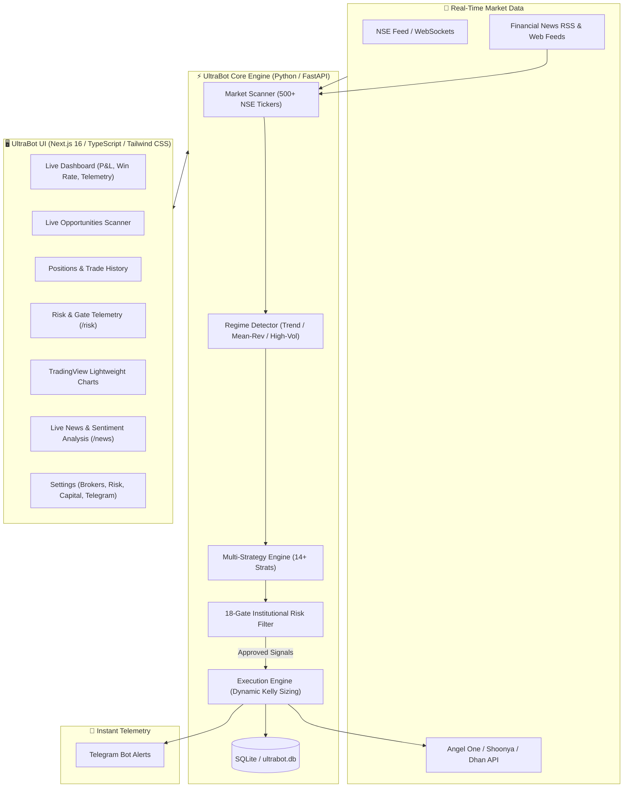

# ⚡ GLM UltraBot — High-Frequency & Algorithmic Trading Terminal

[](https://nextjs.org/)
[](https://react.dev/)
[](https://www.typescriptlang.org/)
[](https://www.python.org/)
[](https://fastapi.tiangolo.com/)
[](https://tailwindcss.com/)
[](LICENSE)

**GLM UltraBot** is an institutional-grade algorithmic trading terminal and autonomous execution engine engineered specifically for the Indian Equity & Derivatives markets (NSE/BSE). Built with a modern **Next.js 16 App Router** frontend and a high-performance **Python FastAPI** backend, UltraBot continuously scans 500+ NSE stocks, classifies market regimes, generates high-probability signals, applies a multi-gate institutional risk pipeline, and executes orders with sub-second precision.

---

## 📑 Table of Contents

- [Key Highlights](#-key-highlights)
- [System Architecture](#-system-architecture)
- [Core Trading Strategies](#-core-trading-strategies)
- [18-Gate Risk Management Pipeline](#-18-gate-risk-management-pipeline)
- [Execution & Position Management](#-execution--position-management)
- [Interactive Technical Charts](#-interactive-technical-charts)
- [Live News & Sentiment Engine](#-live-news--sentiment-engine)
- [Supported Brokers](#-supported-brokers)
- [Project Directory Structure](#-project-directory-structure)
- [Getting Started](#-getting-started)
- [Configuration & Settings](#-configuration--settings)
- [API Reference](#-api-reference)
- [Disclaimer](#-disclaimer)

---

## 🚀 Key Highlights

- **Multi-Broker Architecture**: Direct API execution for **Angel One (SmartAPI)**, **Shoonya (Finvasia)**, **Dhan**, **Fyers**, and seamless zero-risk **Paper Trading**.
- **18-Gate Risk Engine**: Every signal passes through 18 independent quantitative risk filters before execution (VIX filter, capital allocation, correlation, drawdown, slippage, etc.).
- **14+ Algorithmic Strategies**: Core momentum, ORB, Mean Reversion, RSI Divergence, Adaptive Supertrend, Sector Rotation, and News-Driven Momentum.
- **Dynamic Kelly Capital Sizing**: Fractional Kelly Criterion sizing with configurable maximum exposure per position and per sector.
- **3-Stage Profit Booking & Trailing SL**: Auto-scaling partial profit realization (Level 1, 2, 3) and dynamic ATR / fixed-step trailing stop-loss.
- **Interactive Lightweight Charts**: Embedded TradingView Lightweight Charts with EMA bands, VWAP, Bollinger Bands, Support/Resistance zones, and responsive full-screen expansion.
- **Instant Telegram Telemetry**: Real-time alerts for orders, partial booking, stop loss triggers, risk warnings, morning briefings, and EOD reports.
- **Real-time News Sentiment Engine**: Scans live financial RSS feeds (Moneycontrol, Economic Times, Livemint), scoring stock-specific sentiment impact.

---

## 🏛 System Architecture



---

## 🧠 Core Trading Strategies

UltraBot features 14+ quantitative and statistical trading strategies categorized into **Core** and **Advanced** suites:

### 1. Core Strategies
| Strategy | Description | Best Market Regime |
| :--- | :--- | :--- |
| **ORB (Opening Range Breakout)** | Captures 15-minute opening volume expansion breakouts with ATR range targets. | Trending Open |
| **Momentum Surge** | Detects sudden institutional volume spikes paired with EMA (9/21) bullish/bearish crossover. | High Momentum |
| **VWAP Mean Reversion** | Identifies extreme standard deviation stretches beyond VWAP bands for reversion trades. | Range-Bound / Sideways |
| **Supertrend Trend-Following** | Classic multi-factor Supertrend (10, 3) continuation trades on 5m and 15m charts. | Steady Trending |
| **RSI Divergence** | Detects classic regular and hidden RSI divergences near key support/resistance zones. | Reversal / Exhaustion |
| **Breakout Expansion** | Pinpoints multi-day consolidation squeezes breaking out with >2x 20-period average volume. | Volatility Expansion |

### 2. Advanced Strategies
| Strategy | Description | Best Market Regime |
| :--- | :--- | :--- |
| **News-Driven Momentum** | Combines real-time financial news sentiment scores with rapid pre-market/market price action. | Event-Driven |
| **Adaptive Supertrend** | Dynamically shifts ATR multipliers based on India VIX and current intraday volatility. | Volatile Markets |
| **Gap-Fill Reversal** | Trades high-probability mean-reversions on morning opening gaps failing to sustain. | Gap Openings |
| **Multi-Timeframe Confluence** | Requires synchronous bullish/bearish alignment across 5m, 15m, and 1-hour candles. | High-Confidence Trend |
| **Sector Rotation** | Identifies leading sector indices (Nifty Auto, IT, Bank) and longs top-quartile constituents. | Sectoral Outperformance |
| **Trend Exhaustion** | Pinpoints parabolic rallies showing volume climax and candle exhaustion wicks. | Over-extended Trends |

---

## 🛡️ 18-Gate Risk Management Pipeline

Every candidate signal produced by any strategy must pass **18 mandatory risk gates** before an order is placed:

```
[Candidate Signal] ➔ [G1] ➔ [G2] ➔ [G3] ➔ ... ➔ [G18] ➔ [Approved for Execution]
```

1. **Gate 1 (Max Positions)**: Ensures total concurrent open positions do not exceed the configured limit (e.g., max 5).
2. **Gate 2 (Sector Concentration)**: Restricts capital allocation to no more than $N$ trades per sector (e.g., max 2 IT stocks).
3. **Gate 3 (Max Position Size)**: Restricts single position value to a maximum % of total equity (e.g., 20%).
4. **Gate 4 (Max Daily Trades)**: Prevents overtrading by halting execution once daily trade quota is met.
5. **Gate 5 (Max Daily Loss)**: Hard circuit breaker that immediately pauses trading if daily drawdown exceeds configured % (e.g., 3% of capital).
6. **Gate 6 (Correlation Check)**: Rejects trades that have a >0.85 correlation with currently open positions.
7. **Gate 7 (India VIX Filter)**: Prevents high-risk entries when India VIX breaches extreme panic levels (e.g., VIX > 24).
8. **Gate 8 (Time-of-Day Window)**: Restricts new trade entries to safe liquidity hours (`09:20` to `14:30` IST).
9. **Gate 9 (Price Mismatch)**: Verifies that signal trigger price matches actual broker LTP within 0.2% slippage.
10. **Gate 10 (Min Confidence)**: Requires an AI / composite strategy confidence score above threshold (e.g., $\ge 70\%$).
11. **Gate 11 (Max Drawdown)**: Checks portfolio-level peak-to-trough equity curve drawdown.
12. **Gate 12 (Margin & Capital Check)**: Verifies available free margin and buffer capital before sizing.
13. **Gate 13 (Duplicate Signal)**: Deduplicates signals on the same ticker within a dynamic cooldown window.
14. **Gate 14 (Strategy Backtest Gate)**: Verifies recent historical win-rate and expectancy of the triggering strategy.
15. **Gate 15 (Volume & Liquidity)**: Enforces minimum average daily turnover and 5-minute volume threshold.
16. **Gate 16 (Multi-Timeframe Alignment)**: Validates higher timeframe (15m/1h) trend alignment.
17. **Gate 17 (Cost Pre-Check)**: Rejects setups whose expected move cannot clear round-trip brokerage + STT + exchange fees (breakeven guard).
18. **Gate 18 (Per-Strategy Guard)**: Enforces a hard per-strategy daily loss cap and consecutive-loss cooldown, independent of the account-level G5 breaker.

---

## 💰 Execution & Position Management

- **Position Sizing**:
  - **Dynamic Kelly**: Calculates optimal bet fraction $f^* = \frac{p(b+1) - 1}{b}$ clamped between min and max Kelly bounds.
  - **Fixed Risk %**: Allocates capital such that risk per trade does not exceed 1% of account equity.
- **3-Stage Profit Realization**:
  - **Level 1**: Closes 30% of position at $1.5R$ and moves Stop-Loss to Breakeven ($1.0R$).
  - **Level 2**: Closes 30% of position at $2.0R$.
  - **Level 3**: Trails the remaining 40% position at $3.0R+$ using dynamic ATR steps.
- **Automated Intraday Square-off**:
  - Automatically liquidates all intraday open positions at **15:15 IST** to eliminate overnight margin penalties.

---

## 📈 Interactive Technical Charts

Built on **TradingView's Lightweight Charts v5**:
- **Candlestick Engine**: Real-time 5m, 15m, 1h, Daily candle rendering with custom high/low wick shading.
- **Technical Overlays**:
  - Exponential Moving Averages (EMA 9, 21, 50, 200).
  - Volume-Weighted Average Price (VWAP).
  - Supertrend Indicator line.
  - Bollinger Bands (20, 2) volatility envelopes.
  - Dynamic Support & Resistance levels.
- **Device-Responsive & Fullscreen**: Dedicated full-screen modal with expandable viewports tailored for desktop, tablet, and mobile screens.

---

## 📰 Live News & Sentiment Engine

- **Automated Scraping & RSS Ingestion**: Ingests breaking news from major Indian financial portals:
  - *Moneycontrol*
  - *The Economic Times*
  - *Livemint*
  - *CNBC-TV18*
- **Sentiment Classification**: Categorizes news items into **Bullish**, **Bearish**, and **Neutral** with impact scoring.
- **News Focus Stocks**: Highlights high-momentum tickers experiencing breaking corporate developments, quarterly earnings, and regulatory announcements.

---

## 🔌 Supported Brokers

| Broker | Status | Authentication | Live Orders | Paper Trading |
| :--- | :---: | :---: | :---: | :---: |
| **Paper Trading** | ✅ Native | Local Simulation | Virtual | Yes |
| **Angel One (SmartAPI)** | ✅ Ready | API Key + Client Code + TOTP | Live | Yes |
| **Shoonya (Finvasia)** | ✅ Ready | User ID + Password + Vendor Key | Live | Yes |
| **Dhan (DhanHQ)** | ✅ Ready | Client ID + Access Token | Live | Yes |
| **Fyers (API v3)** | ✅ Ready | App ID + Secret + Access Token | Live | Yes |
| **Zerodha (Kite Connect)** | 🔄 Planned | API Key + API Secret + TOTP | Live | Yes |

---

## 📂 Project Directory Structure

```
zerobot_v1/
├── src/
│   ├── app/
│   │   ├── layout.tsx              # Root Next.js layout & theme provider
│   │   ├── page.tsx                # Main live command dashboard
│   │   ├── opportunities/          # Real-time strategy signal scanner
│   │   ├── trades/                 # Open positions & executed trade history
│   │   ├── risk/                   # 18-Gate Risk Management dashboard
│   │   ├── strategies/             # Strategy performance & activation
│   │   ├── news/                   # Live news & sentiment analysis
│   │   ├── watchlist/              # Real-time multi-asset watchlist
│   │   ├── backtest/               # Quantitative strategy backtesting engine
│   │   ├── settings/               # Broker, risk, capital, notification config
│   │   └── api/                    # Next.js App Router API proxy routes
│   │       ├── candles/            # OHLC candle data provider
│   │       ├── risk/limits/        # Dynamic risk parameters sync
│   │       ├── settings/           # Global settings persistence
│   │       ├── live-news/          # Live news RSS feed scraper
│   │       └── opportunities/      # Real-time scan opportunities
│   ├── components/
│   │   ├── chart/                  # TradingView Lightweight Charts & Modal
│   │   ├── layout/                 # Header, Sidebar, Navigation components
│   │   ├── settings/               # Broker credentials & configuration cards
│   │   └── ui/                     # Radix UI / shadcn/ui design components
│   ├── hooks/                      # React Query API hooks (`useApi.ts`)
│   ├── lib/
│   │   ├── api.ts                  # Axios client & backend endpoints
│   │   ├── store.ts                # Zustand global state store
│   │   ├── tradeExecution.ts       # Paper trading engine & trade storage
│   │   └── marketHours.ts          # NSE market timing & holiday calendar
│   └── styles/                     # Tailwind CSS tokens & theme styling
├── ultrabot-web/
│   └── backend/
│       ├── app.py                  # FastAPI server entry point (port 8000)
│       ├── api/                    # REST API route handlers
│       ├── config/                 # YAML configuration & defaults
│       ├── brokers/                # Broker API client adapters
│       ├── core/                   # Engine runner & scheduler loop
│       ├── scanner/                # Real-time multi-stock scanner
│       ├── risk/                   # Risk engine & 18 gate implementations
│       │   ├── risk_engine.py      # Core risk pipeline coordinator
│       │   └── gates/              # G1 through G18 gate modules
│       ├── strategies/             # Strategy definitions & registry
│       │   ├── core/               # ORB, VWAP, Supertrend, Momentum
│       │   └── advanced/           # News, Sector Rotation, Multi-Timeframe
│       ├── news/                   # News aggregators & sentiment models
│       ├── notifications/          # Telegram notification service
│       └── ultrabot.db             # Local SQLite database
├── package.json                    # Node dependencies & launch scripts
├── tsconfig.json                   # TypeScript configuration
└── README.md                       # Project documentation
```

---

## 🛠️ Getting Started

### Prerequisites
- **Node.js**: `v18.17+` or `v20+` (LTS recommended)
- **Python**: `v3.10+` or `v3.11+`
- **Package Manager**: `npm`, `pnpm`, or `bun`

---

### Step 1: Clone the Repository
```bash
git clone https://github.com/S-chandrasekhar176/GLM-ultrabot.git
cd GLM-ultrabot
```

---

### Step 2: Set Up the Python Backend
```bash
# Navigate to the backend directory
cd ultrabot-web/backend

# Create a virtual environment
python -m venv venv

# Activate the virtual environment
# On Windows:
venv\Scripts\activate
# On macOS / Linux:
source venv/bin/activate

# Install required Python dependencies
pip install -r requirements.txt
cd ../..
```

---

### Step 3: Set Up the Next.js Frontend
```bash
# Install Node.js dependencies
npm install
```

---

### Step 4: Run the Development Server
You can run both the frontend and backend concurrently with a single command:
```bash
npm run dev
```

Or run them individually in separate terminals:
```bash
# Terminal 1 (Frontend):
npm run dev:frontend

# Terminal 2 (Backend):
npm run dev:backend
```

- **Frontend Application**: `http://localhost:3000`
- **Backend Swagger API Docs**: `http://localhost:8000/docs`

---

## ⚙️ Configuration & Settings

UltraBot configuration is manageable directly via the UI at `/settings` or through config files:

1. **Virtual Capital & Sizing**:
   - Set virtual capital (e.g., ₹5,00,000) under **Settings ➔ Capital**.
   - Adjust **Max Capital Usage %** (e.g., 80%) and **Per-Position Max %** (e.g., 20%).

2. **Risk Parameters**:
   - Set **Max Daily Loss %** (e.g., 3%).
   - Set **Max Daily Trades** (e.g., 10) and **Max Consecutive Losses** (e.g., 3).
   - Set **Cool-off Period** (e.g., 15 minutes).

3. **Telegram Notifications**:
   - Create a Telegram bot via `@BotFather` and obtain your `Bot Token`.
   - Retrieve your personal/group `Chat ID` via `@userinfobot`.
   - Enter credentials under **Settings ➔ Notifications** and click **Test Notification**.

---

## 📡 API Reference

| Method | Endpoint | Description |
| :--- | :--- | :--- |
| `GET` | `/api/dashboard` | Returns live telemetry, P&L, win rate, and active positions |
| `GET` | `/api/opportunities` | Returns real-time strategy scan candidates |
| `GET` | `/api/candles?symbol=TICKER` | Returns OHLC candlestick history for technical charts |
| `GET` | `/api/risk/limits` | Returns active institutional risk parameters |
| `PUT` | `/api/risk/limits` | Updates risk limits and gate thresholds dynamically |
| `GET` | `/api/settings` | Returns global broker, market hours, and engine settings |
| `PUT` | `/api/settings` | Updates capital, engine, notifications, and market hours |
| `GET` | `/api/live-news` | Returns live financial news feeds and sentiment scoring |
| `POST`| `/api/brokers/{broker}/test` | Tests live connectivity for the specified broker |

---

## ⚠️ Disclaimer

> **IMPORTANT**: Trading in financial markets (Equities, Futures, Options) involves substantial risk of loss and is not suitable for every investor. The algorithms, strategies, risk gates, and signals provided by **GLM UltraBot** are for educational, research, and algorithmic automation purposes. Past performance is not indicative of future returns. Always test thoroughly using **Paper Trading mode** before deploying live capital.

---

## 📄 License

This project is licensed under the **MIT License** — see the [LICENSE](LICENSE) file for details.